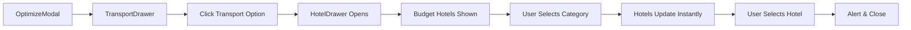

# HotelDrawer Quick Reference

## Component Props

```typescript
interface HotelDrawerProps {
  isOpen: boolean;                    // Control drawer visibility
  onClose: () => void;                // Close handler
  destination: string;                // Display only - from searchedPlace
  checkInDate: string;                // Display only - from selectedDate
  transportMode: 'bus' | 'train' | 'flight';  // Display only - selected transport
  onSubmit?: (hotelData: any) => void;        // Optional callback when hotel selected
}
```

## Hotel Categories & Data

### Budget (Green - DollarSign icon)
- **Count:** 6 hotels
- **Price:** $50-$100/night
- **Rating:** 3.0-4.0 stars
- **Amenities:** Basic (WiFi, Parking, Breakfast)
- **Color:** `bg-green-600 text-white`

### Mid-Range (Blue - TrendingUp icon)
- **Count:** 7 hotels
- **Price:** $100-$200/night
- **Rating:** 4.0-4.5 stars
- **Amenities:** Pool, Gym, Breakfast, Parking, WiFi
- **Color:** `bg-blue-600 text-white`

### Luxury (Purple - Crown icon)
- **Count:** 8 hotels
- **Price:** $200-$500/night
- **Rating:** 5.0 stars
- **Amenities:** All amenities + Special features
- **Features:** Spa, Concierge, Fine Dining, Butler Service, Helipad, etc.
- **Color:** `bg-purple-600 text-white`

## Layout Structure

```
┌─────────────────────────────────────┐
│  Swipe Handle (mobile only)        │ ← Drag to dismiss
├─────────────────────────────────────┤
│  🏢 Find Hotels              ✕      │ ← Fixed header
├─────────────────────────────────────┤
│  📍 Destination: Paris              │ ← Display fields
│  📅 Check-in: 2025-11-20            │   (non-editable)
│  🚌 Transport: Bus                  │
├─────────────────────────────────────┤
│  [💲Budget] [📈Mid] [👑Luxury]      │ ← Sticky category buttons
├─────────────────────────────────────┤
│                                     │
│  💲 Budget Hotels ($50-$100)        │
│                                     │
│  ┌─────────────────────────────┐   │
│  │ Comfort Inn Downtown    $65 │   │ ← Scrollable
│  │ ⭐⭐⭐⭐ (3.5)                 │   │   hotel cards
│  │ 📶 🚗 ☕                      │   │
│  │ 📍 0.5 km from center       │   │
│  └─────────────────────────────┘   │
│                                     │
│  [More hotels...]                   │
│                                     │
│  Cancel                             │
└─────────────────────────────────────┘
```

## Integration Flow



## Key Features

### Auto-Behavior ✨
- Opens with Budget category pre-selected
- Shows results immediately (no "Find Hotels" button)
- Instant category switching
- Auto-scroll to top when changing categories

### Interactions 🖱️
- **Click category button** → Switch hotels instantly
- **Click hotel card** → Select & close drawer
- **Click X or Cancel** → Close drawer
- **Swipe down (mobile)** → Dismiss drawer
- **Press Escape** → Close drawer

### Styling 🎨
- **Colors:** Green (Budget), Blue (Mid), Purple (Luxury)
- **Spacing:** Compact - p-3, gap-2
- **Icons:** w-5 h-5
- **Text:** text-xs for labels
- **Hover:** border-blue-500, shadow-md
- **Selected:** Colored bg, scale-105

### Amenity Icons 🏨
| Icon | Amenity | LucideReact |
|------|---------|-------------|
| 📶 | WiFi | Wifi |
| 🌊 | Pool | Waves |
| 💪 | Gym | Dumbbell |
| ☕ | Breakfast | Coffee |
| 🚗 | Parking | Car |

## Usage Example

```tsx
import { HotelDrawer } from '../components/HotelDrawer';

function MyComponent() {
  const [isOpen, setIsOpen] = useState(false);

  return (
    <HotelDrawer
      isOpen={isOpen}
      onClose={() => setIsOpen(false)}
      destination="Paris, France"
      checkInDate="2025-11-20"
      transportMode="bus"
      onSubmit={(hotel) => {
        console.log('Selected hotel:', hotel);
      }}
    />
  );
}
```

## Customization Points

### Add Real API Data
Replace `DUMMY_HOTEL_DATA` in HotelDrawer.tsx:
```typescript
const DUMMY_HOTEL_DATA = {
  budget: [...],
  midrange: [...],
  luxury: [...]
};
```

### Modify Categories
Update `HOTEL_CATEGORIES`:
```typescript
const HOTEL_CATEGORIES = [
  { value: 'budget', label: 'Budget', icon: DollarSign, ... },
  // Add more categories
];
```

### Change Default Category
Modify in `useEffect`:
```typescript
useEffect(() => {
  if (isOpen) {
    setSelectedCategory('midrange'); // Change from 'budget'
  }
}, [isOpen]);
```

## Accessibility ♿

- ✅ ARIA labels on buttons
- ✅ Keyboard navigation (Tab, Enter, Escape)
- ✅ Focus indicators
- ✅ Screen reader friendly
- ✅ Semantic HTML structure

## Performance 🚀

- ✅ Lazy rendering (only when open)
- ✅ Optimized re-renders
- ✅ Touch event throttling
- ✅ Smooth animations (300ms)
- ✅ No layout shifts

## Browser Support 🌐

- ✅ Chrome/Edge (latest)
- ✅ Firefox (latest)
- ✅ Safari (latest)
- ✅ Mobile browsers (iOS/Android)

## Troubleshooting

### Drawer doesn't open
- Check `isOpen` prop is true
- Verify no z-index conflicts
- Check parent component state

### Categories don't switch
- Verify `selectedCategory` state updates
- Check `DUMMY_HOTEL_DATA` structure
- Ensure `setShowResults(true)` is called

### Hotels not displaying
- Verify dummy data is imported
- Check `hotelResults` mapping
- Inspect console for errors

### Icons missing
- Ensure lucide-react is installed
- Check icon imports at top of file
- Verify icon names are correct
