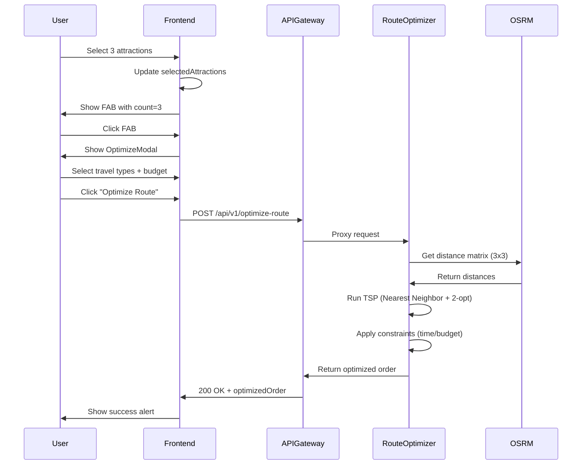

# ✅ Route Optimization Implementation - Complete

## 📋 Overview

This implementation covers the **FIRST CRITICAL STEP** in the trip planning flow:

```
User selects attractions → Frontend sends to backend → Backend optimizes route → Returns optimized order
```

**What this does:**
✅ User selects 1+ attractions from discovery page  
✅ FAB appears with selection count  
✅ User clicks FAB → Optimization modal opens  
✅ User selects travel types, budget, options  
✅ Frontend sends request to backend  
✅ Backend runs TSP/2-opt + distance matrix + constraints  
✅ Backend returns optimized order **plus** transport legs, polyline geometry, and timeline  
✅ Frontend displays result  

**What this does NOT do (comes later):**
❌ PDF generation  
❌ Detailed cost breakdown per traveler  

---

## 🏗️ Architecture

### Frontend Flow

```
VirtualizedAttractionFeed
  ↓ (user selects attractions)
SelectionFAB (appears when count > 0)
  ↓ (user clicks)
OptimizeModal (collects preferences)
  ↓ (user submits)
useOptimizeRouteMutation (API call)
  ↓
routeOptimizer.api.ts (axios POST)
```

### Backend Flow

```
API Gateway (:4000)
  ↓ proxy
Route Optimizer Service (:4010)
  ↓
RouteOptimizerService
  ├─ Build Distance Matrix (OSRM/Haversine)
  ├─ Run TSP (Nearest Neighbor + 2-opt)
  ├─ Apply Constraints (time/budget/priority)
  ├─ Fetch Transport Legs + Polylines
  ├─ Build Timeline + Summary
  └─ Persist enriched itinerary

RouteJobStore (in-memory TTL)
  └─ Serves GET /api/v1/optimize-route/:jobId
```

---

## 📁 Files Created/Modified

### Frontend

1. **`apps/trip-planner/src/api/routeOptimizer.api.ts`** ✅ NEW
   - Axios client for `/api/v1/optimize-route`
   - Error handling
   - Retry logic with exponential backoff

2. **`apps/trip-planner/src/hooks/useRouteOptimizer.ts`** ✅ NEW
   - React Query mutation hook
   - Caching and state management

3. **`apps/trip-planner/src/components/discovery/VirtualizedAttractionFeed.tsx`** ✅ MODIFIED
   - Added `OptimizeModal` integration
   - Added `handleOptimizeSubmit` function
   - Builds proper `OptimizeRouteRequest` payload
   - Calls mutation with success/error handlers

### Backend

4. **`api-gateway/src/index.ts`** ✅ MODIFIED
   - Added proxy route: `/api/v1/optimize-route` → Route Optimizer Service
   - 60 second timeout for complex optimizations
   - Optional auth support

4. **`route-optimizer/src/handlers/optimize-route.handler.ts`** ✅ MODIFIED
  - Request validation (Zod schemas)
  - Calls `RouteOptimizerService`
  - Persists enriched itinerary into in-memory job store
  - Returns JSON response with legs + timeline + geometry

5. **`route-optimizer/src/lib/route-job-store.ts`** ✅ NEW
  - Simple TTL-based in-memory persistence for optimized itineraries
  - Enables polling via `GET /api/v1/optimize-route/:jobId`

6. **`route-optimizer/src/services/route-optimizer-v2.service.ts`** ✅ MODIFIED
  - **Distance Matrix**: OSRM (with Haversine fallback)
  - **TSP Optimization**: Nearest Neighbor + 2-opt
  - **Constraints**: Time budget, priority filtering
  - **Transport Legs**: Calls Transportation Service per leg with fallbacks
  - **Timeline Builder**: Computes arrival/departure stamps using visit durations
  - **Polyline Generation**: Fetches OSRM polylines per leg
  - Returns optimized order + legs + timeline + geometry summary

7. **`route-optimizer/src/index.ts`** ✅ MODIFIED
  - Registered `/api/optimize-route-v2` endpoint
  - Added `GET /api/v1/optimize-route/:jobId` for polling persisted itineraries

---

## 🔌 API Contract

### Request

```typescript
POST /api/v1/optimize-route
Content-Type: application/json
Authorization: Bearer <token> (optional)

{
  "userId": "uuid", // optional
  "places": [
    {
      "id": "p1",
      "name": "Marina Bay Sands",
      "lat": 1.2838,
      "lng": 103.8607,
      "imageUrl": "https://...",
      "priority": 8, // 1-10
      "visitDuration": 90 // minutes
    },
    {
      "id": "p2",
      "name": "Gardens by the Bay",
      "lat": 1.2816,
      "lng": 103.8636,
      "priority": 9,
      "visitDuration": 120
    }
  ],
  "constraints": {
    "startLocation": { "lat": 1.290, "lng": 103.850 }, // optional
    "startTime": "2025-11-14T09:00:00+08:00", // optional
    "timeBudgetMinutes": 480, // 8 hours
    "travelTypes": ["PUBLIC_TRANSPORT", "WALKING"],
    "budget": 50 // optional
  },
  "options": {
    "includeRealtimeTransit": true,
    "algorithm": "auto" // "TSP_2OPT" | "RAPTOR" | "auto"
  }
}
```

### Response

```typescript
200 OK
{
  "success": true,
  "jobId": "job-abc123",
  "optimizedOrder": [
    { "placeId": "p2", "seq": 1 },
    { "placeId": "p1", "seq": 2 }
  ],
  "estimatedDurationMinutes": 320,
  "totalDistanceMeters": 12000,
  "legs": [
    {
      "from": { "placeId": "p2", "seq": 1 },
      "to": { "placeId": "p1", "seq": 2 },
      "travelType": "transit",
      "travelTimeSeconds": 900,
      "distanceMeters": 5400,
      "cost": 3.2,
      "steps": [
        {
          "mode": "transit",
          "from": "Marina Bay Sands",
          "to": "Gardens by the Bay",
          "distanceMeters": 5400,
          "durationSeconds": 900,
          "route": "Bus 42",
          "departureTime": "2025-11-15T09:30:00+08:00",
          "arrivalTime": "2025-11-15T09:45:00+08:00"
        }
      ],
      "polyline": "y|qeAujyv...",
      "provider": "transport-service"
    }
  ],
  "timeline": [
    {
      "placeId": "p2",
      "seq": 1,
      "arrivalTime": "2025-11-15T09:00:00+08:00",
      "departureTime": "2025-11-15T10:30:00+08:00",
      "visitDurationMinutes": 90
    },
    {
      "placeId": "p1",
      "seq": 2,
      "arrivalTime": "2025-11-15T10:45:00+08:00",
      "departureTime": "2025-11-15T12:15:00+08:00",
      "visitDurationMinutes": 90
    }
  ],
  "routeGeometry": {
    "legs": [
      { "seq": 1, "travelType": "transit", "polyline": "y|qeAujyv..." }
    ]
  },
  "summary": {
    "startsAt": "2025-11-15T09:00:00+08:00",
    "endsAt": "2025-11-15T18:20:00+08:00",
    "totalVisitMinutes": 270,
    "totalTravelMinutes": 150
  },
  "notes": "Includes multimodal transport legs, timeline, and geometry.",
  "processingTime": "845ms"
}
```

### Poll optimized itinerary by jobId

```
GET /api/v1/optimize-route/{jobId}
```

```json
{
  "success": true,
  "job": {
    "jobId": "job-abc123",
    "optimizedOrder": [...],
    "legs": [...],
    "timeline": [...],
    "summary": {...},
    "routeGeometry": {...},
    "storedAt": 1731650400000,
    "processingTimeMs": 845
  },
  "cached": true
}
```

### Error Response

```typescript
400 Bad Request / 500 Internal Server Error
{
  "success": false,
  "error": "Invalid request data",
  "details": [
    { "path": "places", "message": "At least 2 places required" }
  ]
}
```

---

## 🧮 Algorithms Used

### 1. Distance Matrix

**Method**: OSRM (Open Source Routing Machine)  
**Fallback**: Haversine formula  

```typescript
// OSRM API call
GET http://router.project-osrm.org/route/v1/driving/{lng1},{lat1};{lng2},{lat2}

// Returns: distance (meters), duration (seconds)
```

### 2. TSP Optimization

**Algorithm**: Nearest Neighbor + 2-opt Improvement

```typescript
// Step 1: Nearest Neighbor (greedy initialization)
route = [0] // Start at first place
while (not all visited):
  next = nearest unvisited place
  route.push(next)

// Step 2: 2-opt (iterative improvement)
improved = true
while (improved):
  for each pair (i, j) in route:
    if swapping(i, j) reduces distance:
      swap and mark improved
```

**Complexity**: O(n²) per iteration  
**Suitable for**: 2-50 attractions

### 3. Constraints

- **Time Budget**: Filter route to fit within time window
- **Priority**: (Future) Favor high-priority places
- **Budget**: (Future) Filter expensive options

---

## 🧪 Testing

### Frontend Test

```bash
# Start frontend
cd travel-ecosystem/apps/trip-planner
npm run dev
```

1. Open http://localhost:5173
2. Search for attractions
3. Select 2+ attractions (checkboxes)
4. Click FAB (blue circular button)
5. Select travel types + budget
6. Click "Optimize Route"
7. Check console for request/response
8. Should show alert with result

### Backend Test

```bash
# Start services
cd travel-ecosystem-backend

# Terminal 1: API Gateway
cd api-gateway
npm run dev

# Terminal 2: Route Optimizer
cd micro-services/route-optimizer
npm run dev
```

**Manual API Test**:

```bash
curl -X POST http://localhost:4000/api/v1/optimize-route \
  -H "Content-Type: application/json" \
  -d '{
    "places": [
      { "id": "p1", "name": "Place 1", "lat": 1.2838, "lng": 103.8607 },
      { "id": "p2", "name": "Place 2", "lat": 1.2816, "lng": 103.8636 },
      { "id": "p3", "name": "Place 3", "lat": 1.2800, "lng": 103.8500 }
    ],
    "constraints": {
      "timeBudgetMinutes": 480,
      "travelTypes": ["WALKING"],
      "budget": 50
    },
    "options": {
      "includeRealtimeTransit": false,
      "algorithm": "auto"
    }
  }'
```

Expected:
```json
{
  "success": true,
  "jobId": "...",
  "optimizedOrder": [
    { "placeId": "p3", "seq": 1 },
    { "placeId": "p2", "seq": 2 },
    { "placeId": "p1", "seq": 3 }
  ],
  "estimatedDurationMinutes": 65,
  "totalDistanceMeters": 4500,
  "processingTime": "234ms"
}
```

---

## 🚀 Environment Setup

### Frontend `.env`

```env
VITE_API_BASE_URL=http://localhost:4000
```

### API Gateway `.env`

```env
PORT=4000
ROUTE_OPTIMIZER_SERVICE_URL=http://localhost:4010
```

### Route Optimizer `.env`

```env
PORT=4010
OSRM_URL=http://router.project-osrm.org
GOOGLE_MAPS_API_KEY=<optional>
```

---

## 📊 Sequence Diagram



---

## ✅ What's Next?

This implementation handles **Step 1** of the trip planner flow.

**Next Steps** (not in this section):

1. **User-adjustable leg selection**
  - Surface multiple transport options per leg and let users lock a preference.

2. **Cost + carbon analytics**
  - Aggregate per-leg cost and emissions into richer trip insights.

3. **PDF / shareable itinerary**
  - Call PDF Service, embed polylines and timeline, expose download link.

---

## 🐛 Troubleshooting

### Frontend Issues

**Problem**: `OptimizeModal` doesn't show  
**Solution**: Check `isModalOpen` state in console

**Problem**: API call fails with CORS error  
**Solution**: Verify API Gateway CORS settings include frontend URL

**Problem**: TypeScript errors  
**Solution**: Run `npm install` in trip-planner directory

### Backend Issues

**Problem**: Route Optimizer not responding  
**Solution**: Check if service is running on port 4010

**Problem**: OSRM timeout  
**Solution**: Service falls back to Haversine automatically

**Problem**: Invalid request error  
**Solution**: Check request matches Zod schema exactly

---

## 📦 Dependencies

### Frontend
- `axios` - HTTP client
- `@tanstack/react-query` - Data fetching/caching
- `lucide-react` - Icons

### Backend
- `fastify` - HTTP server
- `zod` - Request validation
- `haversine-distance` - Distance calculations
- `axios` - OSRM API calls
- `uuid` - Job ID generation

---

## 🎯 Success Criteria

✅ User can select multiple attractions  
✅ FAB appears with correct count  
✅ Modal opens with travel options  
✅ API request sent on submit  
✅ Backend receives and validates request  
✅ Distance matrix computed successfully  
✅ TSP algorithm returns optimized order  
✅ Response returned in < 2 seconds  
✅ Frontend displays success message  
✅ No console errors  

---

## 📝 Summary

**What was implemented:**

1. ✅ Frontend attraction selection UI
2. ✅ Floating Action Button (FAB)
3. ✅ Optimization modal with preferences
4. ✅ API client with retry logic
5. ✅ React Query mutation hook
6. ✅ API Gateway proxy route
7. ✅ Route Optimizer service handler
8. ✅ Distance matrix computation
9. ✅ TSP optimization (Nearest Neighbor + 2-opt)
10. ✅ Constraint application
11. ✅ Proper error handling
12. ✅ Request/response validation

**Result**: Complete working flow from user selection to optimized route order! 🎉

---

## 📞 Support

If issues occur:
1. Check all services are running (Gateway:4000, Optimizer:4010)
2. Verify `.env` files are configured
3. Check browser console for frontend errors
4. Check terminal logs for backend errors
5. Test API directly with curl
