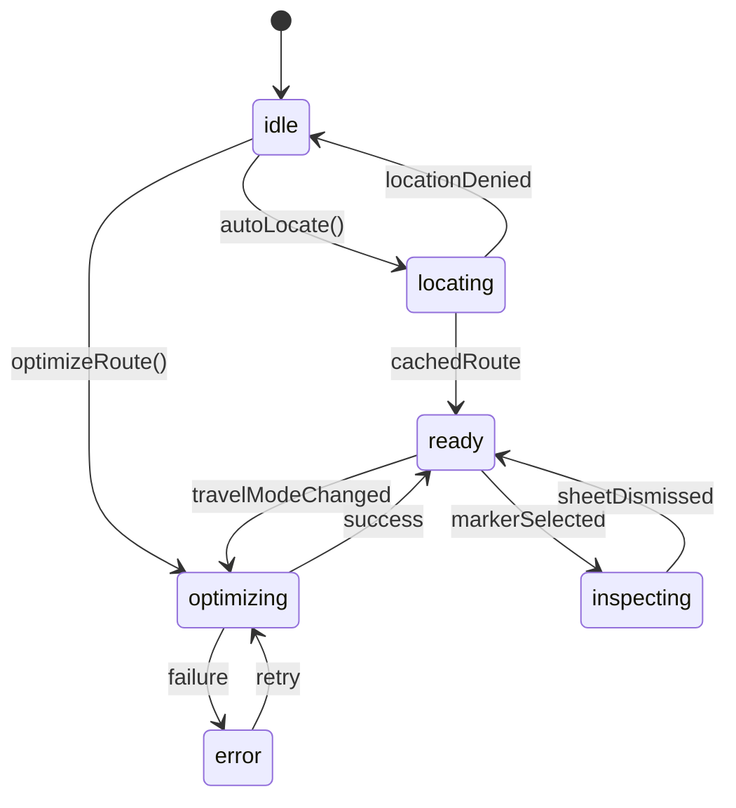

# Route Optimizer Experience — Product & UI Blueprint

## 1. Layout System (Figma-style breakdown)

| Surface | Viewport priority | Description |
| --- | --- | --- |
| **Hero Map Canvas** | 65% height on mobile, 70% on desktop | Full-bleed `react-leaflet` map with Mapbox-inspired styling. Layers: (1) dynamic gradient background, (2) route polylines with per-leg colors, (3) numbered shadow markers (48px touch targets), (4) user-location dot, (5) floating summary card + FAB cluster. |
| **Travel Mode Rail** | Top overlay | Segmented chips (Walking / Driving / Transit). Each chip = 48px height, 16px horizontal padding, icon + label, uses Tailwind tokens `bg-white dark:bg-slate-900`, `shadow-lg`, `rounded-full`. Active chip animates via `framer-motion` layoutId for pill highlight. |
| **Floating Summary Card** | Top-left overlay | Glassmorphic card (blur + gradient) showing total ETA, distance, cost range, dynamic countdown. Tailwind spacing grid (8px). Icons from `lucide-react`. |
| **Bottom Sheet** | Primary interaction for place details | Apple Maps–style sheet: 28px top radius, grab handle, 85vh max, scrollable body. Opens when marker/timeline card tapped. Contains: place hero info, arrival/departure, visit duration, CTA buttons (`View Details`, `Start Navigation`). Buttons use full-width 48px height + icon. |
| **Timeline / Instruction Stack** | Below map on desktop, collapsible tab on mobile | Material You inspired cards stacked vertically with soft shadows and pastel accents. Each stop card includes arrival/departure, visit duration, chip for travel type, and between cards a connector showing travel time + distance. Steps list sits in accordion per leg. |
| **Sticky CTA Bar** | Bottom of viewport | Persistent actions: `Start Navigation` and `Share Trip`. Semi-transparent background, backdrop blur, safe-area padding on mobile, dark-mode aware. |

Spacing grid: base unit 8px. Margins: 16px mobile, 32px desktop. Typography scale: `text-[28px]` hero numbers, `text-base` body, `text-sm` meta labels. Color palette: sky gradient (#e0f2ff→#fef7ff), bold contrast tokens (#0f172a, #2563eb), dark mode flips to slate/emerald accents.

## 2. Component Architecture

```
PlanYourTrip (page)
├─ SearchWithFilter + SuggestedPlace (existing)
└─ RouteOptimizerExperience (new feature)
   ├─ RouteExperienceMachine (hook managing finite states)
   ├─ RouteLayout
      ├─ MapViewport
      │   ├─ LeafletMap
      │   │   ├─ RoutePolylines
      │   │   ├─ AttractionMarkers
      │   │   └─ UserLocationMarker
      │   ├─ TravelModeChips
      │   ├─ TripSummaryCard
      │   ├─ RecenterFab + AutoLocateFab
      │   └─ ProgressOverlay (animated)
      └─ DetailsPanels
          ├─ PlaceBottomSheet (marker-driven)
          ├─ TimelineView (mobile-first vertical timeline)
          └─ StepsAccordion (per-leg instructions)
```

Supporting utilities:

- `routeUtils.ts`: transforms API payload → UI-friendly structures, decodes polylines via `@mapbox/polyline`, assigns color tokens per leg, derives statistics (total minutes, ETA countdown, bounds list).
- `routeColors.ts`: deterministic palette for legs.
- `useUserLocation.ts`: wraps Geolocation API w/ permission + timeout handling.
- `RouteOptimizerSlice`: Redux slice storing API response, status, selected leg/marker, travel mode, user location, ETA ticker.
- `optimizeRouteThunk`: orchestrates POST to `/trip-planning/route-optimize`, falls back to deterministic mock payload when backend unavailable, emits analytics events.

## 3. State Machine (navigation + UX orchestration)



- **Context payload**: `{ travelMode, selectedPlaces, routeData?, userLocation?, focusedSeq?, bottomSheetSeq?, error? }`
- **Guards**: `hasPlaces >= 2`, `geolocationSupported`, `routeData?.legs?.length`.
- **Actions**: `dispatchOptimize(travelMode)`, `setUserLocation`, `fitBounds`, `openSheet(seq)`, `closeSheet`, `retry`.
- **Side-effects**: API call with cancellation token, `navigator.geolocation.getCurrentPosition`, `map.flyTo`, `window.open` for Google Maps navigation.

This state machine ensures deterministic transitions between loading, ready, and inspection states while keeping UX responsive on slow networks.
